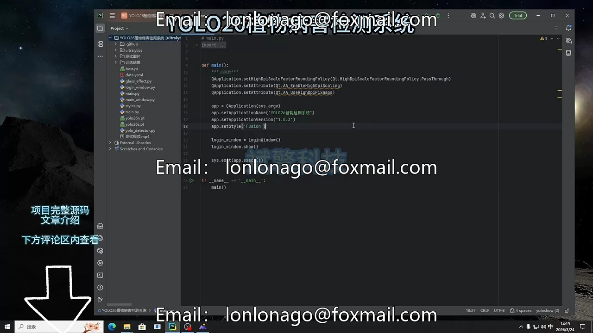
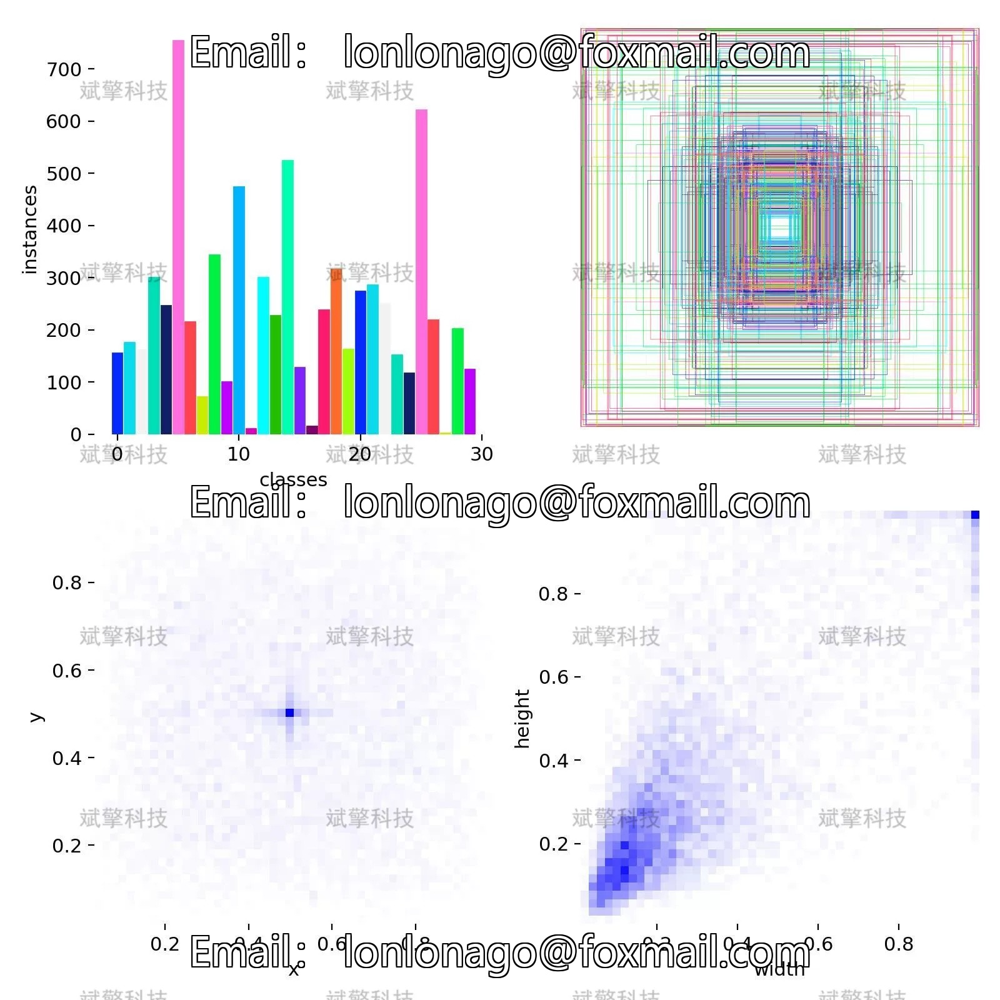
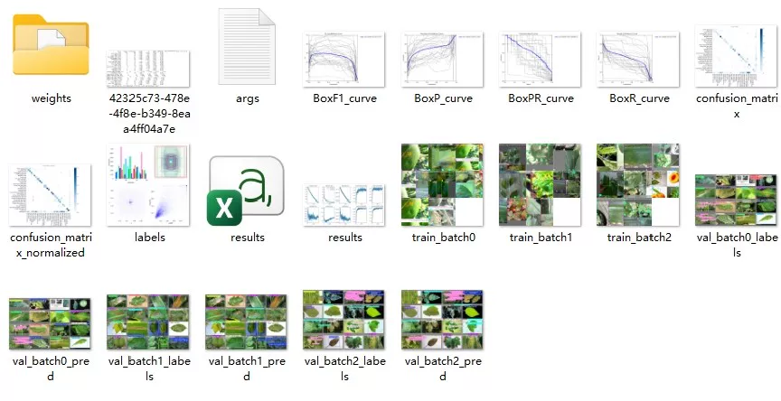
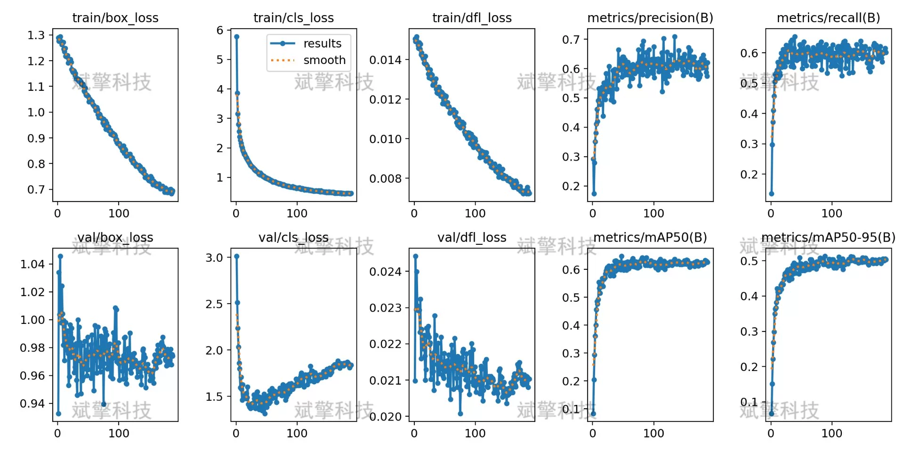
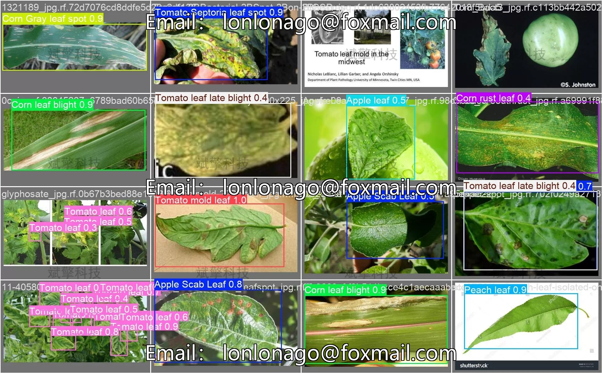
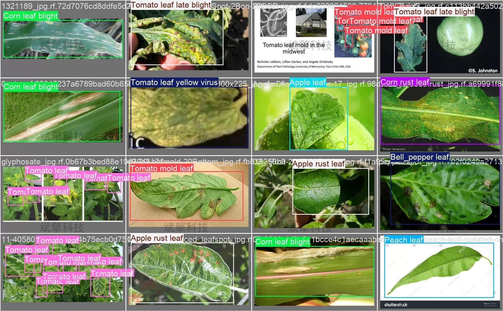
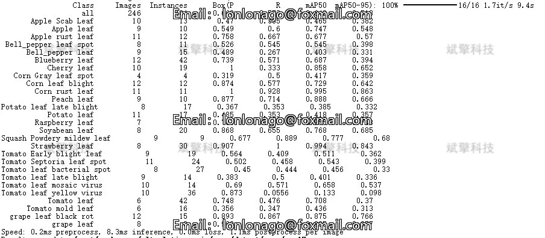
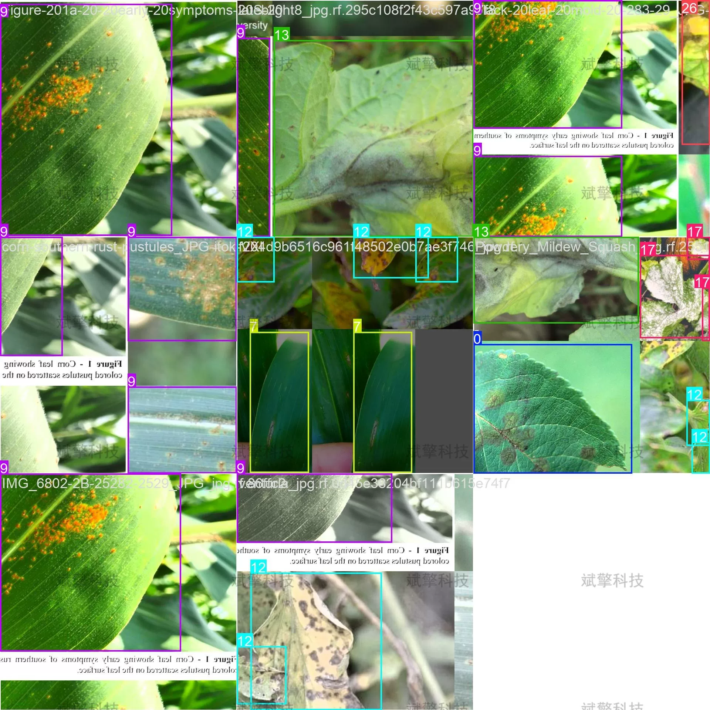

# YOLO26 Plant Leaf Disease Detection System | Source Code

## Body

YOLO26 Plant Leaf Disease Detection System | Source Code: YOLO26 Multimodal Plant Disease Detection System Design and Full Stack Realization: Data Set Construction, Model Training, and Deployment in a Complete Process

Plant diseases are one of the main factors affecting global agricultural production. Timely and accurate disease detection is crucial for ensuring crop yield and quality. This study builds an intelligent detection system for 30 types of plant leaf diseases based on the YOLO26 object detection algorithm. The dataset includes 2009 training images and 246 validation images, covering the health and diseased leaves of various economic crops such as apples, tomatoes, grapes, corn, potatoes, strawberries, etc.

The plant leaf dataset used in this study contains 30 categories, covering the healthy leaves and common diseases of various economic crops. The total number of images in the dataset is 2255, including 2009 training images and 246 validation images, divided approximately at a ratio of 9:1.

Free reservation for remote installation. Unsuccessful installation will result in a full refund.
Purchase comes with the following resources (auto-unlocked in Baidu Cloud):
   - YOLO recognition detection project complete source code
   - YOLO format dataset
   - Training code + UI interface code
   - Trained model + results image
   - Software installation package
   - Add WeChat to make a reservation for remote installation (automatically display WeChat ID after purchase) - Unsuccessful, full refund

⚙️ Core Function Modules
Detection Capability
    Image Detection: Upon upload, return detection boxes + category information
    Video Detection: Support video files, analyze each frame accurately
    Camera Real-Time Detection: Integrate USB camera, achieve dynamic monitoring
Interaction and Control
    Target Filtering: Choose one or more categories for detection
    Parameter Real-Time Adjustment: Adjustable confidence threshold & IoU threshold, flexibly control accuracy
    Result Save: One-click save results in images/videos/camera detection
System and Data
    User Registration and Login: Support password strength check + encryption storage
    Log Recording: Automate operation and error information recording (with timestamp)

## Images

## Payment

Here is a pay link on Stripe ( https://buy.stripe.com/3cs8yP7sY87d0vu9AB ). Please contact me lonlonago@foxmail.com after funding $89, and I will send you a complete data files , thank you!

